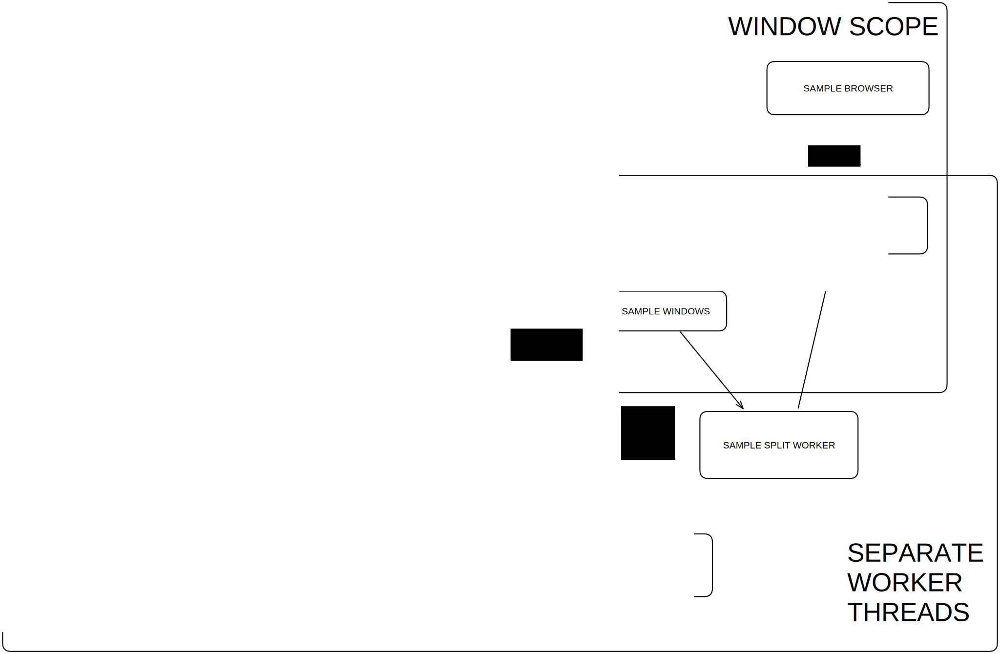

# wavChunks

## What is this?

It is a sample splitting proof of concept running completely in the browser

## Motivation

This is an experimental piece of a larger project [samplekiller.com](https://samplekiller.com). I needed to get sample splitting working in the browser, but it was such a big feature that I needed to develop it separately.

## Installation

1. git clone REPO
1. cd REPO
1. npm install
1. npm run dev -- --open

## Usage

Upload a wavefile of samples you've recorded and it will generate audio clips at onsets

## Web workers

The detection algorithm runs in a webworker named 'detectWorker.js'. This is just a single web worker and it's my first time using them. Here is a proposed system diagram for this module as it will need to be implemented for the main samplekiller app. 

### Notes on this development

Fixing samplekiller.com for public use took two weeks of intense work and long days. I had to go much broader and much deeper than I expected.

I learned the Web Audio API and all about webworkers. I committed myself to typescript and/or jsdoc. I discovered new resources outside of MDN. Especially the WHATWG spec and google's technical blogs. I reached out to another developer working on similar ideas and I read his source code. I also attempted to read chromium source code.

Looking at my data and reading documentation helped me break through blockages to achieve the goal.

## Things I want to try next

- Automatic testing with selenium or similar

- Audio Context playback with MediaElementAudioSourceNode (or similar)

  - This could allow me to replace a lot of jank on samplekiller.com, especially the preloading of audio src as the user browses samples and I suspect and hope it might perform better and use less memory
  - The current version of wavChunks chokes on a ~300MB / 17 minute 24-bit wav file while using waveFile.getSamples(). The wavefile.js library is somehow copying it 10X+ in browser memory and eventually crashes the browser tab. 👎
    - This was actually caused by de-interleaving and reinterleaving stereo recordings

- Normalize audio

  - We can capture the peak volume of each sound then multiply the whole clip by .95/peak
  - If we switch to audio context playback this will be a k-rate gain node that we set at the beginning of each sample
  - Maybe a better way would just be to normalize the audio in place
  - When we export, we will have to process it anyway so we can just do it ahead of time with offlineAudioContext

- Eliminate tiny samples smaller than 10ms

- Fade out end of audio samples

- Generate spectograms and/or waveforms
  - use these to automatically classify with a small deep learning model
  - it would be nice if we could create a model that determines aesthetic quality and encourages variation in sample packs

## Things I want to try for the next project

- Use whisper AI to rename clips or create clip cues for use with something like [losslesscut](https://github.com/mifi/lossless-cut)
- Detect and remove "ums" and non speech noises via my other killer app [fillerkiller](https://github.com/evanburnette/fillerkiller)
